# MACS — Git for AI Agents

> When 10 agents work on the same project, who does what? What changed? Who's affected?
>
> **MACS keeps your agents in sync.** No servers, no setup, just files + Git.

[](https://www.npmjs.com/package/macs-protocol)
[](#)
[](#license)
[](https://github.com/Vdc-K/macs-protocol/stargazers)

[English](#quick-start) | [中文](#中文)

---

## See It In Action



**One command. 5 agents. 12 tasks. Dependency-ordered, zero conflicts.**

---

## The Problem

You have multiple AI agents working on the same codebase:

```
Agent-001 changes the API return format
Agent-002 doesn't know, keeps using the old format
Agent-003 changes the database schema
→ Everything breaks
```

**A2A/MCP solve how agents talk. MACS solves how agents work together without chaos.**

## How It Works

```
.macs/
├── protocol/          ← Agents read/write here (JSONL, fast, no conflicts)
│   ├── tasks.jsonl    # Task lifecycle events (append-only)
│   ├── events.jsonl   # All changes, decisions, conflicts
│   ├── state.json     # Current snapshot (auto-rebuilt)
│   └── agents.json    # Who's here, what can they do
│
├── sync/inbox/        ← Agent-to-agent messaging
│   ├── agent-001/
│   └── agent-002/
│
└── human/             ← Auto-generated Markdown (for you to read)
    ├── TASK.md
    └── CHANGELOG.md
```

**Agents write JSONL → Humans read Markdown. Best of both worlds.**

## Quick Start

```bash
npm install -g macs-protocol

cd my-project
macs init "My Project"

# Launch 5 agents on 12 tasks — dependency-ordered, zero conflicts
macs swarm --agents "lead:architect|eng1:backend,api|eng2:frontend|qa:testing|devops:infra" --simulate
```

### Agent session (one command)

```bash
# Boot: register → check inbox → show status → recommend next task
macs boot --agent eng1-sonnet --capabilities backend,api
```

### Human commands

```bash
macs status          # Project overview (tasks, agents, review queue, escalations)
macs log             # Immutable event history
macs impact src/auth # Which agents/tasks does this file affect?
macs drift           # Silent tasks (agents may be stuck)
```

## Why MACS?

### vs. just using Git

Git tracks file changes. MACS tracks **who's doing what, what depends on what, and who gets affected by changes.**

### Comparison

|  | **MACS** | A2A / MCP | LangGraph | CrewAI |
|--|----------|-----------|-----------|--------|
| **Layer** | Work coordination | Communication | Orchestration | Orchestration |
| **Analogy** | Git | HTTP | Airflow | Supervisor |
| **State model** | Event sourcing (JSONL) | Message passing | Graph nodes | Sequential tasks |
| **Multi-agent** | Native (swarm, handoff) | Protocol only | Manual wiring | Role-based |
| **Requires server** | No — just files + Git | Yes | No | No |
| **Works offline** | ✅ | ❌ | ✅ | ✅ |
| **Session continuity** | ✅ `macs boot` | ❌ | ❌ | ❌ |
| **Dead agent recovery** | ✅ Auto-reap | ❌ | ❌ | ❌ |
| **Human oversight** | ✅ Built-in escalation | ❌ | Partial | Partial |
| **Any LLM / framework** | ✅ File-based | Depends | Partial | Partial |

> **MACS is complementary to A2A/MCP** — use MCP for agent-to-tool calls, A2A for cross-org agent communication, and MACS for coordinating the actual work.

## Key Features

**Event Sourcing** — Every action is an append-only event. No conflicts, full history, any state can be rebuilt.

```jsonl
{"type":"task_created","id":"T-001","ts":"...","by":"lead-opus","data":{"title":"Add auth"}}
{"type":"task_assigned","id":"T-001","ts":"...","by":"lead-opus","data":{"assignee":"engineer-sonnet"}}
{"type":"task_completed","id":"T-001","ts":"...","by":"engineer-sonnet","data":{"artifacts":["src/auth.ts"]}}
```

**Capability Routing (3.1)** — Tasks declare `requires_capabilities`. Only capable agents can claim them. Swarm simulation is capability-aware.

```bash
macs create "Train embedding model" --requires ml,gpu
macs claim --agent ml-agent   # skips tasks it can't do
```

**Forced Handoff** — Blocking or cancelling a task requires `--next`. No context ever lost between sessions.

```bash
macs block T-007 --reason "need OAuth decision" \
  --next "wire JWT into middleware" \
  --done "schema designed" --issue "refresh token unspecified"
```

**Review Chain (3.10)** — Agents can request peer review before marking done. Approved → completed. Rejected → back to in_progress.

```bash
macs review T-009 --agent lead-opus --result approved --note "LGTM"
```

**Escalation (3.11)** — Blocked on a human decision? Escalate and optionally auto-resume after timeout.

```bash
macs escalate T-012 --reason "GDPR compliance sign-off needed" --to cto --timeout 60
```

**Dead Agent Reaping (3.12)** — Silent agents are detected and their tasks reassigned automatically.

```bash
macs reap --threshold 45   # mark agents silent > 45 min as dead, reassign tasks
```

**Drift Detection** — `macs drift` surfaces tasks whose agents haven't checkpointed recently.

**Swarm Orchestration** — `macs swarm` auto-distributes tasks across N agents in dependency-ordered rounds.

**Human-Readable Output** — `human/` directory auto-generates Markdown from JSONL. You never lose readability.

## Platform Support

Works with any AI agent framework:

| Platform | Support |
|----------|---------|
| Claude Code | Native |
| Cursor | Adapter |
| Aider | Adapter |
| Continue.dev | Adapter |
| Ollama + local models | Adapter |
| LM Studio | Adapter |
| LangChain / CrewAI / AutoGen | Python SDK |
| Any tool that reads files | Just works |

```bash
# One-line install, auto-detects your platform
./install.sh
```

## Positioning

```
Communication Layer     Work Layer          Capability Layer
(how agents talk)      (how agents        (how agents evolve)
                        coordinate)
┌──────────────┐       ┌──────────┐       ┌──────────────┐
│ A2A (Google) │       │   MACS   │       │ EvoMap (GEP) │
│ MCP (Anthr.) │       │          │       │              │
│ ACP (IBM)    │       │          │       │              │
└──────────────┘       └──────────┘       └──────────────┘

Three layers, complementary, not competing.
```

## Roadmap

- [x] **v3.0** — JSONL Protocol, Event Sourcing, Agent SDK, inbox messaging, swarm, forced handoff, drift detection, task decomposition
- [x] **v3.1** — Capability routing, review chain, escalation protocol, dead agent reaping (111 tests)
- [ ] **v3.2** — Smart drift analysis, auto-escalation triggers
- [ ] **v4.0** — A2A/MCP bridge, hosted coordination layer

## License

MIT © 2026

---

## 中文

# MACS — AI Agent 的 Git

> 10 个 agent 同时改一个项目，谁做什么？改了什么？影响谁？
>
> **MACS 让你的 agent 保持同步。** 不需要服务器，不需要配置，只要文件 + Git。

## 问题

多个 AI agent 在同一个代码库里工作：

```
Agent-001 改了 API 返回格式
Agent-002 不知道，继续用旧格式
Agent-003 改了数据库 schema
→ 整个系统崩了
```

**A2A/MCP 解决 agent 怎么说话。MACS 解决 agent 怎么一起干活不乱套。**

## 原理

```
.macs/
├── protocol/          ← Agent 读写这里（JSONL，快，无冲突）
│   ├── tasks.jsonl    # 任务生命周期事件（只追加）
│   ├── events.jsonl   # 所有变更、决策、冲突
│   ├── state.json     # 当前状态快照（自动重建）
│   └── agents.json    # 谁在、能做什么
│
├── sync/inbox/        ← Agent 间通信
│   ├── agent-001/
│   └── agent-002/
│
└── human/             ← 自动生成的 Markdown（给人看）
    ├── TASK.md
    └── CHANGELOG.md
```

**Agent 写 JSONL → 人读 Markdown。两全其美。**

## 快速开始

```bash
npx macs init
# 搞定。你的项目现在有 .macs/ 了
```

## 核心特性

- **Event Sourcing** — 每个操作都是只追加事件，无冲突，完整历史
- **能力路由（3.1）** — 任务声明所需能力，只有匹配的 agent 能认领
- **强制 handoff** — block/cancel 必须留下 `--next` 交接记录，上下文不丢
- **Review Chain（3.10）** — 支持同行审查，approved → 完成，rejected → 返回修改
- **升级协议（3.11）** — 遇到人类决策瓶颈时升级，支持超时自动恢复
- **死 Agent 重分配（3.12）** — 心跳超时的 agent 自动标记为 dead，任务重新分配
- **漂移检测** — 静默任务自动标记，防止 agent 卡死无人知晓
- **Swarm** — `macs swarm --agents N` 按依赖轮次自动分配任务
- **人类可读** — `human/` 目录自动从 JSONL 生成 Markdown

## 定位

```
通信层（怎么说话）    工作层（怎么协作）    能力层（怎么进化）
A2A (Google)         MACS（我们）         EvoMap (GEP)
MCP (Anthropic)
ACP (IBM)

三层互补，不竞争。
```

## 平台支持

支持所有 AI agent 框架：Claude Code、Cursor、Aider、Continue、Ollama、LM Studio、LangChain、CrewAI、AutoGen，以及任何能读文件的工具。

```bash
./install.sh  # 一键安装，自动检测平台
```

## 开源协议

MIT © 2026
